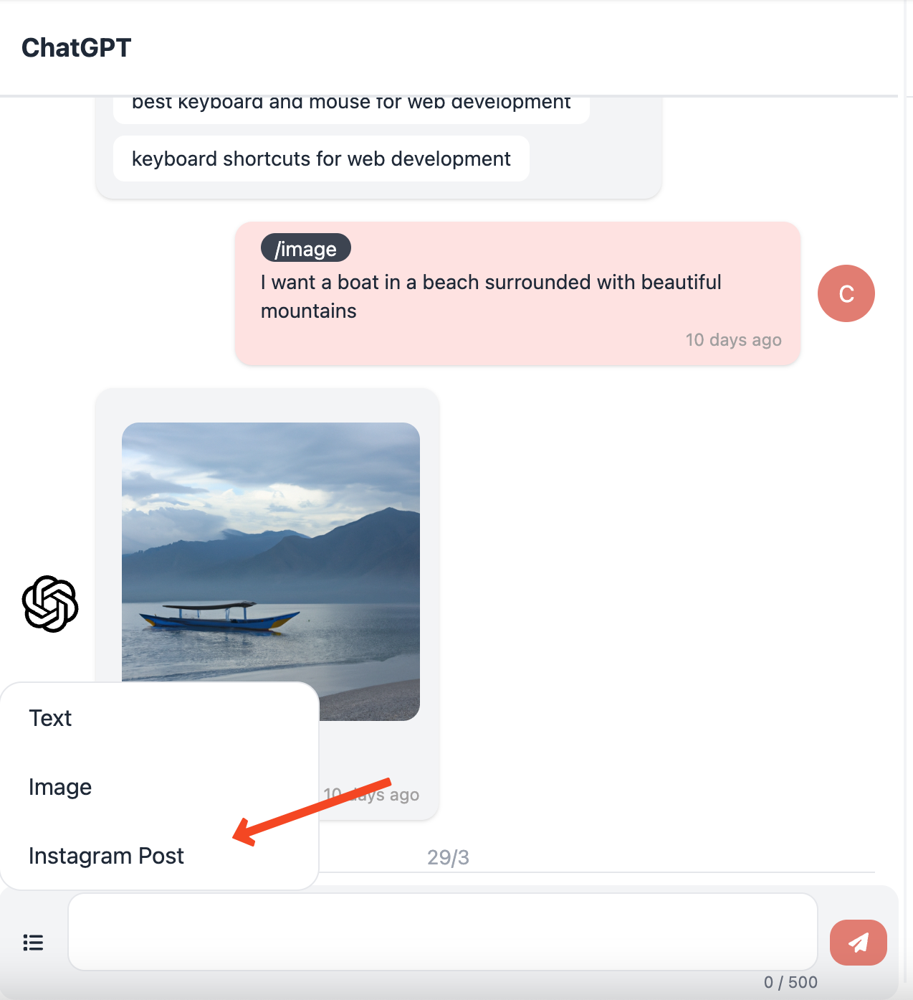

# ⌨ Text Feature

### How to use this feature?

Go to your ChatGPT Chatroom and click Text from the settings panel.

<figure><figcaption></figcaption></figure>

After clicking the Text Feature you will see a settings panel is opened on the right side of the chat and the Text Field will be enabled for you to write.

### Settings Guide

<figure><figcaption>
Settings For Text
</figcaption></figure>

The settings for the Text generation have three parts:

* Writing Style - You can choose the writing style to be anywhere from academic to business style
* Writing Tone 1 - You can choose the tone level between informal and formal tone
* Writing Tone 2 - You can choose the tone level to be between friendly and assertive

The writing style is a select box and you can choose an option.

The writing tones are sliders, that can be changed using the slider shown in the image above.

### Sending The Message

To send the message you have to simply write your question or prompt to ChatGPT in the text field just like any other chat. And ChatGPT will use the settings you chose above and the prompt to generate a quick and effective response for you also with follow up questions.

### Follow Up Questions

As ChatGPT is an excellent person to talk to and it feels like you are talking to a real person, we have created our own AI system to think of some great follow-up questions for you to choose from

<figure><figcaption>
Example follow up questions and response
</figcaption></figure>

We have used previous training data to tailor-made these follow-up questions and make them precise to what you asked prior to ChatGPT. To use these follow-up questions, you simply have to click the white bubble and press the send button.
