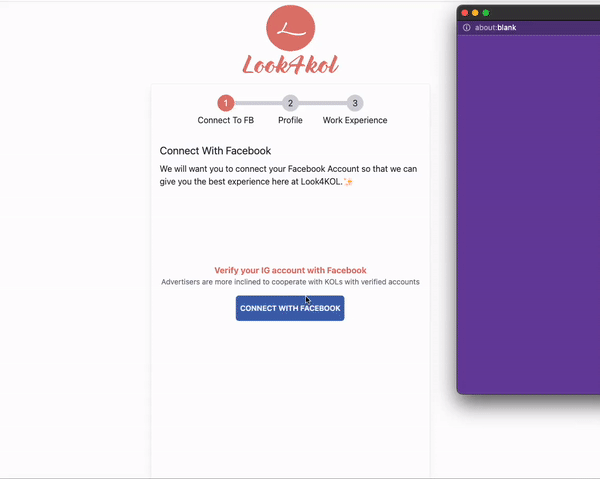

# 🎯 How to Sign up as a KOL

To sign up as a KOL on Look4KOL, make sure to satisfy all the prior requirements of having Linked a Facebook Business Page with an Instagram Business/Creator Account.

If not please refer to this support article. [facebook-page-link-to-ig-creator-account.md](facebook-page-link-to-ig-creator-account.md "mention")

### Register Form:

1. To go to the registration page as KOL go to this [link](https://look4kol.com/en/register?type=KOL).

<figure><figcaption>
Register Form For Sign Up as KOL
</figcaption></figure>

2\. Fill out this form and press the Create Button to create an account successfully.

<figure><figcaption>
Log in to go to the sign up page
</figcaption></figure>

3\. log in to the account you just created using the registered email and password and wait for a few seconds. ⏳

4\. You will see this signup page.


To proceed to the next step you will have to finish linking your IG account with your FB account. If not done please refer to the article below.

[facebook-page-link-to-ig-creator-account.md](facebook-page-link-to-ig-creator-account.md "mention")


<figure><figcaption>
Look4KOL sign up page
</figcaption></figure>

5\. Press the blue button to connect with Facebook.

<figure><figcaption>
Steps to be taken when connecting with Facebook
</figcaption></figure>

6\. Fill in all the details and complete your profile.

<figure><figcaption>
Second Step to complete sign up.
</figcaption></figure>

7\. Press Next

8\. You can now add **Case Studies** and **Service Plans**.

9\. Press Complete and wait till your KOL Profile is completed.

Thank you so much.

Tune into how to present your KOL Profile and also how to edit it here. [kol-profile](../kol-profile/ "mention")
