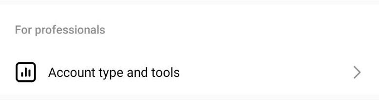

# 🙋 How to apply as Instagram Creator Account


If you already have a creator or business account you can skip this step


You can convert your personal or business profile into a creator account to access features that make it easier to control your online presence, understand your growth, and manage your messages. If your personal account is private, completing these steps will make it public. Note that all pending follow requests will be automatically accepted when you go public. If you want to create a new creator account, rather than convert your existing personal account, you can [create a new Instagram account and convert it to a creator account](https://www.facebook.com/help/instagram/155940534568753?helpref=faq\_content).


Note: [you may only have five Instagram accounts](https://help.instagram.com/1682672155283228?helpref=faq\_content) at a time.


#### To switch your personal account or business profile to a creator account:

1. Go to your account and tap .png>).
2. Select  then tap  .png>) **Settings and privacy**.
3. Select   .
4.
   * If you are migrating from a personal account, choose Switch to professional account and tap Creator.
   * If you are migrating from a business profile, choose Switch to creator account.
5. Select your category. You can choose a category that best describes what you do.
6. If desired, connect to your Facebook Page
7.
   * If you have a Facebook Page you would like to link to your account, select it from the list that appears.
   * If you do not want to link a Facebook Page, select Skip.
8. Review your contact information. At least one form of contact information is required. You'll have the option to display or hide this on your profile.
9. Choose your profile display options. You can decide whether to hide or display your category and contact details on your profile.
