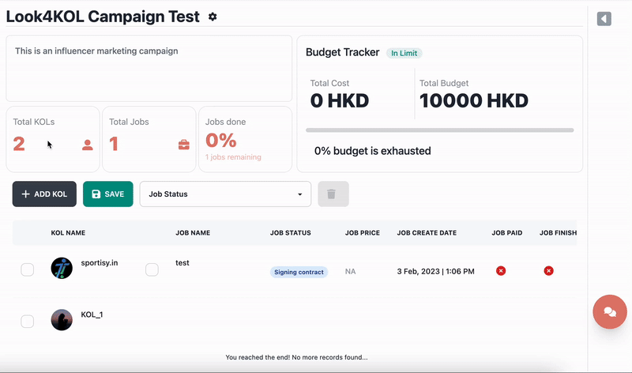
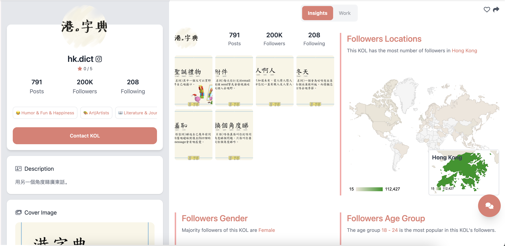

# 🛠 Project Tools

Hey There 👋🏻! Thanks for using our project management system, let’s go through a simple walkthrough on how to use this tool. This tool is designed for campaign management, KOL management, and also to track the current jobs with the KOL in look4kol. It can also be used as a tool to compare and select KOL for further analysis. Moreover, there is also a very modern budget tracking tool in this.

<figure><figcaption></figcaption></figure>

## What about Project Tools:

There are typically _**3 main sections**_ on the project tools page:

1. _Project Trackers_
2. _Project Table and its functions_
3. _Project Side Section_

### Project Trackers:

&#x20;The Project Trackers include your campaign description, your project statistics as well as your budget tracker.

#### &#x20;Campaign Description:

&#x20;This is where you can see your campaign description and this section is also scrollable if you have a long description.

<figure><figcaption>
Red Boxed area is Campaign Description
</figcaption></figure>

#### &#x20;Project Statistics:

&#x20;The total number of KOLs selected in your project currently is the first block:

<figure><figcaption>
First Boxed Area is Total Number of KOLs Selected
</figcaption></figure>

The total number of Jobs associated with this project is the second block:

<figure><figcaption>
Second Boxed Area is The number of Jobs in the project
</figcaption></figure>

For easier convenience, we give you a job tracker as well. Where you can see the number of jobs done and also a percentage of how many jobs are finished out of how many are still left:

<figure><figcaption>
Third Boxed Area is the number of Jobs Done
</figcaption></figure>

#### Budget Tracker:

&#x20;The budget tracker gives you the total budget and total cost. Moreover, the percentage of the budget exhausted is also shown in the progress bar given.

<figure><figcaption>
Red Boxed area is the budget tracker
</figcaption></figure>

### Project Table and its functions:

&#x20;The project table controls all the main functions of the project system. It is where you can monitor and see all the data of your selected KOLs. This table gives you functions to add KOL, save Table, and Delete Jobs/KOLs.

<figure><figcaption>
Sample Project Table
</figcaption></figure>

**The table can have multiple rows:**


If a KOL has only one Job then the first row is filled. The rest of the jobs is appended on the first job of the KOL.


_Every Row of the table has multiple columns, the columns include:_

* Checkbox to select the KOL and all its jobs
* KOL Avatar and Name
* Checkbox to select the particular job of the KOL in that row
* Job Name
* Job Status (This is real-time and can vary on the job status in the chatroom)
* Job Price
* Job Create Date
* Job Paid (This is a boolean value)
* Job Finish (This is a boolean value)

&#x20;_There are some hover functions on each row of the table:_


All these functions will open the side panel of the Project Page


&#x20;**If the row is a KOL-defining row:**

* Chat Preview
* KOL Preview
* All Job List&#x20;

**If the row is Job defining row:**

* View Particular Contract.

### Side Section/Panel of the Project Page:

As mentioned above there are many functions of the buttons in the table and all of them lead to this section.

_**Chat Preview**_ 💬_**:**_

This will show you a preview of your chat with the KOL, in fact, you can actually chat with the KOL yourself using this small section.

<figure><figcaption></figcaption></figure>

_**KOL Preview**_ 👧🏻:

This will open the side panel and give a piece of brief information about the KOL.

<figure><figcaption></figcaption></figure>

_**Job List**_** 📑**:

This will show the jobs with this KOL in a list format.

_**Particular Job ✍🏻**_:

<figure><figcaption></figcaption></figure>

## How to edit your Project's Basic Information?

It is straightforward to edit your current project from the project page.

1. &#x20;On the top right corner, you will see a gear icon, next to your campaign name. ⚙
2. You can click that icon to get a modal to pop up.
3.  The modal has three important fields that describe your project

    1. Campaign Name
    2. Campaign Description
    3. Campaign Budget

4. Once done editing you can press the save button to save the change. ✅

&#x20;

&#x20;
