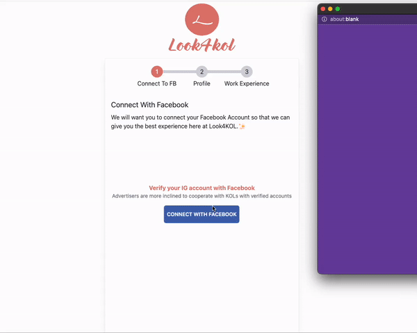

# 🎯 如何註冊成為 KOL

要在 Look4KOL 上註冊為 KOL，請確保滿足將 Facebook 商業帳戶與 Instagram 業務/創作者帳戶相關聯的所有先決條件。

如果沒有，請參閱此文章。

[ig-business-account-creator-account.md](ig-business-account-creator-account.md "mention")

### 註冊:

1. 要作為 KOL 轉到註冊頁面，請轉到此 [link](./).

<figure><figcaption>
註冊成為Look4KOL KOL 
</figcaption></figure>

2\. 填寫此表格並按創建按鈕以成功創建帳戶。

<figure><figcaption>
登錄及註冊頁面
</figcaption></figure>

3\. 使用註冊的電子郵件和密碼登錄到您剛剛創建的帳戶，然後等待幾秒鐘。 ⏳

4\. 您將看到此註冊頁面。


要繼續下一步，您必須完成 IG 帳戶與 FB 帳戶的鏈接。 如果沒有完成請參考下面的文章。

[facebook-page-link-to-ig-creator-account.md](facebook-page-link-to-ig-creator-account.md "mention")


<figure><figcaption>
Look4KOL 註冊頁面
</figcaption></figure>

5\. 按藍色按鈕連接 Facebook。

<figure><figcaption>
連接 Facebook 時要採取的步驟
</figcaption></figure>

6\. 填寫所有詳細信息並完成您的個人資料。

<figure><figcaption>
Second Step to complete sign up.
</figcaption></figure>

7\. 按「下一步」

8\. 您現在可以添加「過去去案例」和「服務計劃」。

9\. 按完成並等待您的 KOL 個人資料完成。

了解如何展示您的 KOL 個人資料以及如何在此處對其進行編輯。&#x20;


[kol-profile](../kol-profile/)

