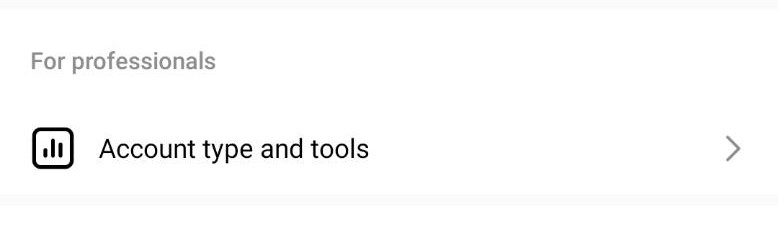

# 🙋 如何申請成為 Instagram 商業帳戶/創作者帳戶


如果您已經擁有Instagram創作者或企業帳戶，則可以跳過此步驟


您可以將您的個人Instagram或企業帳戶轉換為Instagram創建者帳戶，以訪問更容易控制您的在線狀態、了解您的成長和管理您的消息的功能。 如果您的個人帳戶是私人帳戶的，完成這些步驟將使其公開。請注意，當您公開時，所有待處理的關注請求將被自動接受。如果您想創建一個新的創作者帳戶，而不是轉換您現有的個人帳戶，您可以 [創建一個新的 Instagram 帳戶並將其轉換為創作者帳戶](https://www.facebook.com/help/instagram/155940534568753?helpref=faq\_content)


注意：您[一次只能擁有五個 Instagram 帳戶](https://help.instagram.com/1682672155283228?helpref=faq\_content)。


#### 要將您的個人賬戶或企業帳戶切換為創作者賬戶：

1. 轉到您的帳戶並點擊 .png>)。
2. 選擇 及 .png>)設置和隱私。
3. 選擇 。
4.
   * 如果您從個人帳戶遷移，請選擇切換到專業帳戶並點擊創建者。
   * 如果您是從企業帳戶遷移，請選擇切換到創建者賬戶。
5. 選擇您的類別。 您可以選擇最能描述您所做工作的類別。
6. 如果可以，連接到您的 Facebook 頁面
7.
   * 如果您有 Facebook 專頁並希望連接到您的帳戶，請從出現的列表中選擇它。
   * 如果您不想連接 Facebook 頁面，請選擇跳過。
8. 查看您的聯繫信息。 至少需要一種形式的聯繫方式。 您可以選擇在您的個人資料中顯示或隱藏它。
9. 選擇您的個人資料顯示選項。 您可以決定是隱藏還是顯示您的個人資料中的類別和聯繫方式。
