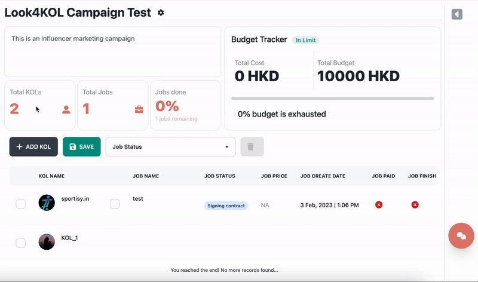

# 🛠 專案工具

Hi 👋🏻！ 感謝您使用我們的專案管理系統，讓我們通過一個簡單的演練來了解如何使用這個工具。 該工具專為活動管理、KOL 管理而設計，還可以跟踪 Look4KOL 中 KOL 的當前工作。 它還可以用作比較和選擇 KOL 以進行進一步分析的工具。 此外，其中還有一個非常現代的預算跟踪工具。

<figure><figcaption></figcaption></figure>

### 專案工具怎麼樣：

專案工具頁面上通常有 **3 個主要部分**：&#x20;

1. 專案追踪器
2. 專案KOL表及其功能
3. 專案側面板部分

### 專案追踪器：

專案跟踪器包括您的營銷活動描述、項目統計信息以及預算跟踪器。

#### 營銷活動描述：

在這裡您可以看到您的活動描述，如果您的描述很長，此部分也可以滾動。

<figure><figcaption>
紅框區域為營銷活動說明
</figcaption></figure>

#### 營銷活動統計：

當前在您的項目中選擇的 KOL 總數是第一塊：

<figure><figcaption>
第一個方框區域是選擇的 KOL 總數
</figcaption></figure>

與此項目關聯的工作總數是第二個塊：

<figure><figcaption>
Second Boxed Area is The number of Jobs in the project
</figcaption></figure>

為了更方便，我們還為您提供了一個工作跟踪器。 您可以在哪裡看到已完成的工作數量以及已完成的工作數量佔剩餘工作數量的百分比：

<figure><figcaption>
Third Boxed Area is the number of Jobs Done
</figcaption></figure>

#### 預算跟踪器：

預算跟踪器為您提供總預算和總成本。 此外，預算用盡的百分比也顯示在給定的進度條中。

<figure><figcaption>
紅框區域是預算跟踪器
</figcaption></figure>

### 專案KOL表及其功能：

項目表控制著項目系統的所有主要功能。 您可以在此處監控和查看所選 KOL 的所有數據。 此表為您提供添加 KOL、保存表和刪除作業/KOL 的功能。

<figure><figcaption>
Sample Project Table
</figcaption></figure>

**該表可以有多行：**


如果 KOL 只有一個工作，則第一行會被填滿。 其餘工作附加在 KOL 的第一份工作之上。


表格的每一行都有多個列，列包括：

* 用於選擇 KOL 及其所有工作的複選框
* KOL頭像和名字
* 用於選擇該行中 KOL 的特定工作的複選框
* 工作名稱
* 工作狀態（這是實時的，可能會因聊天室中的工作狀態而異）
* 工作價格
* 工作創建日期
* 工作是否已經支付
* 工作是否已經完成

表格的每一行都有一些懸停功能：


所有這些功能將打開項目頁面的側面板


&#x20;**** 如果該行是 KOL 行：

* 聊天預覽
* KOL 預覽
* 與該KOL的所有工作列表

如果該行是工作行：

* 查看特定合約

### 專案側面板部分：

如上所述，表中的按鈕有很多功能，它們都指向本節。

#### 聊天預覽 _****_ 💬

這將向您展示您與 KOL 聊天的預覽，事實上，您實際上可以使用這個部分與 KOL 聊天。

<figure><figcaption></figcaption></figure>

#### KOL 預覽 _****_ 👧🏻：

這將打開側面板並提供有關 KOL 的簡要信息。

<figure><figcaption></figcaption></figure>

#### 與該KOL的所有工作列表📑：

這將以列表格式顯示此 KOL 的工作。

具體工作✍🏻：

<figure><figcaption></figcaption></figure>

### 如何編輯專案的基本信息？

從項目頁面編輯當前專案非常簡單。

1. 在右上角，您會在專案名稱旁邊看到一個齒輪圖標。 ⚙
2. 您可以單擊該圖標以彈出模式。
3.  該模式具有三個字段來描述您的項目

    1. 專案名稱
    2. 專案描述
    3. 專案預算

4. 完成編輯後，您可以按保存按鈕保存更改。 ✅

&#x20;

&#x20;
